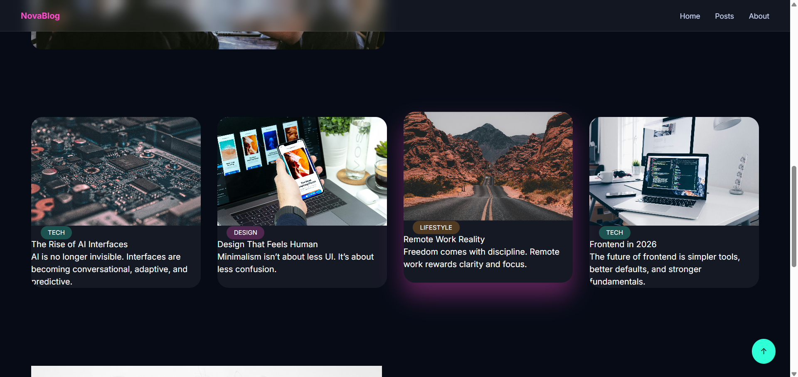

# 🌌 NovaBlog – Modern Blog Website

NovaBlog is a modern, vibrant, and fully responsive blog website inspired by premium blog layouts (like Blogy), but built from scratch with a unique design and structure.

## ✨ Features
- Modern hero section with gradient typography
- Glassmorphism UI
- HD imagery
- Responsive grid layout
- Clean HTML, CSS & JavaScript
- Perfect for portfolio & GitHub

## 🛠 Tech Stack
- HTML5
- Tailwind CSS (CDN)
- Custom CSS
- Vanilla JavaScript

## 📸 Website Preview

### 🖥 Desktop View

### 📱Post View

> Take screenshots after deployment and place them in a `screenshots/` folder.

## 🚀 How to Run
1. Clone the repo
2. Open `index.html` in browser
3. Or deploy via Netlify

## 📄 License
MIT – free to use and modify.
